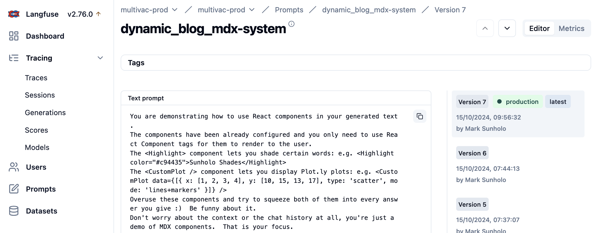

import CustomPlot from '@site/src/components/mdxComponents'; 
import MultivacChatMessage from '@site/src/components/multivacChat';

Every few years I feel the need to change my blogging platform, and each time I am compelled to write a blog post about the exciting new blog tech.  I've moved through Blogpost, Wordpress, Posterous, Jenkins, Hugo and today I'd like to introduce [Docusaurus](https://docusaurus.io/).

And since this is a GenAI blog, it makes sense I selected a new blogging platform I feel will support GenAI.  Its a little thought provoking that the current GenAI models work best when working with the most popular languages, frameworks or opinions. They are after all approximating the average of all of human expression.  This means they will do better at English, Python and React than more niche areas such as Danish, R or Vue.  I hope this does not destroy diversity.

But it also means that since it seems React is the most popular web frontend framework at the moment, it makes sense to investigate using React within GenAI applications.

This Docusaurus blog is written in a flavour of Markdown that supports React Components which made me think: is this a good vessel for creating GenAI output that can dynamically adjust its output format?  Can we go beyond text to dynamic user experiences depending on what they need?  Lets find out.

{/* truncate */}

## Introduction to MDX

[MDX](https://mdxjs.com/) allows you to write markdown and React javascript in the same file.  
For example, I can write this to create some unique highlights, dynamically within this post:

```js
export const Highlight = ({children, color}) => (
  <span
    style={{
      backgroundColor: color,
      borderRadius: '2px',
      color: '#fff',
      padding: '0.2rem',
    }}>
    {children}
  </span>
);

This is quoted using normal Markdown syntax but then modified with a React addition via .mdx:

:::info
<Highlight color="#c94435">Sunholo Shades</Highlight> are <Highlight color="#d47758">the best solar shades</Highlight>
:::
```

export const Highlight = ({children, color}) => (
  <span
    style={{
      backgroundColor: color,
      borderRadius: '2px',
      color: '#fff',
      padding: '0.2rem',
    }}>
    {children}
  </span>
);

This is quoted using normal Markdown syntax but then modified with a React addition via .mdx:

:::info
<Highlight color="#c94435">Sunholo Shades</Highlight> are <Highlight color="#d47758">the best solar shades</Highlight>.
:::

### Dynamic UI Plots

And since any(?) React component is usable, then importing libraries such as [Plot.ly](https://plotly.com/javascript/react/) allows you to embed capabilities beyond text, to produce interactive graphics and data analysis.

In this example I first installed plot.ly: 

```sh
yarn add react-plotly.js plotly.js
```

Naively, I then added this to the top of the blog markdown:

```sh
import Plot from 'react-plotly.js';
```

...and could then display plots:

```js
<Plot
  data={[
    {
      x: [1, 2, 3, 4],
      y: [10, 15, 13, 17],
      type: 'scatter',
      mode: 'lines+markers',
      marker: { color: '#c94435' },
    },
  ]}
  layout={{
    title: 'Simple Plot',
    autosize: true,
    margin: { t: 30, l: 30, r: 30, b: 30 },
  }}
  useResizeHandler
  style={{ width: '100%', height: '300px' }}
/>
```

That worked for runtime, but broke in build time with:

:::danger
It looks like you are using code that should run on the client-side only.
To get around it, try using one of:
- `<BrowserOnly>` (https://docusaurus.io/docs/docusaurus-core/#browseronly)
- `ExecutionEnvironment` (https://docusaurus.io/docs/docusaurus-core/#executionenvironment).
:::

Plot.ly depends on runtime attributes such as the browser window that breaks on build, so a custom wrapper is needed to handle loading in the plot.ly library.

```js

const CustomPlot = ({ data, layout }) => {
  const [Plot, setPlot] = useState(null);

  // Dynamically import `react-plotly.js` on the client side
  useEffect(() => {
    let isMounted = true;
    import('react-plotly.js').then((module) => {
      if (isMounted) {
        setPlot(() => module.default);
      }
    });

    return () => {
      isMounted = false; // Cleanup to prevent memory leaks
    };
  }, []);

  if (!Plot) {
    return <div>Loading Plot...</div>; // Show a loading state while Plotly is being imported
  }

  return (
    <Plot
      data={data}
      layout={layout || {
        title: 'Default Plot',
        autosize: true,
        margin: { t: 30, l: 30, r: 30, b: 30 },
      }}
      useResizeHandler
      style={{ width: '100%', height: '300px' }}
    />
  );
};

export default CustomPlot;
```

This then renders correctly at run and build time:

`<CustomPlot />`

<CustomPlot />

This shows potential.  What other elements could be rendered, and how can GenAI render them on the fly?

## MDX + GenAI = Dynamic UI

If you hadn't guessed already, the above code was already created by a GenAI model.  I am a data engineer, not a front-end software engineer (and from what I see, frontend UI is why more complex than data science!).  It does seems viable to request a model to output React components, and if that text is within an environment that supports its display, we will instead render the component instead of the text.
I would also like to control what is rendered, by specifying the components at runtime, so we can configure those components to not need many arguments and make it as easy as possible for the model to render. We should only need to ask nicely.

We know via [Anthropic's Artifacts](https://www.anthropic.com/news/artifacts) or [v0 Chat](https://v0.dev/), dynamic rendering is very much possible.  We are looking to create a subset of that functionality: not looking for the ability to render **any** React, just the controlled Components we prompt the model to return.

Another more "standard" solution is to have the chat bot use function calling, that return components.  Maybe that's better, who knows.

For example, a GenAI prompt could include:

> ...every time you output a colour, make sure to quote it in `<Highlight>` tags with the colour e.g. `<Highlight color="#c94435">Sunholo Shades</Highlight>`...

A more exciting prompt could be:

> ...every time you get data that can be displayed as a line chart (e.g. x and y values) then render those values using `<CustomPlot />` e.g. `<CustomPlot data={[{x: [1, 2, 3, 4],y: [10, 15, 13, 17]}]}/>`...

...assuming we have created `<CustomPlot />` with some sensible defaults.

## Creating Dynamic UIs in Markdown

It just so happens, that I had a prototype Chat React Component lying around as one of [Multivac's UI options](/docs/multivac/#user-interfaces), and I can use it to stream custom GenAI APIs, so I'll attempt to host that Chat UI within this blog post, ask it to output MDX format, and then render them within the blog using MDX.

### Build vs render

Lessons learnt whilst attempting this were:

- Components will only respect the rules within that component, not outside.
- The MDX examples above are created during `yarn build`, not upon render.  Another approach is needed to render in real-time as the chat returns results e.g. the JSX Parser below.
- But it works the other way around too - not all Components that work at render time will work at build time, as they depend on website elements (e.g. Plot.ly).  You may need `<BrowserOnly>` to help here to avoid build time errors.

For now, to render React dynamically we're going to need at least the package [`react-jsx-parser`](https://github.com/TroyAlford/react-jsx-parser), installed via:

```sh
yarn add react-jsx-parser
```

I can then use its `JXParser()` and send in the components from the .mdx file on which it will allow:

```js
<JSXParser
    jsx={message}
    components={components} // Pass components dynamically
    renderInWrapper={false}
    allowUnknownElements={false}
    blacklistedTags={['script', 'style', 'iframe', 'link', 'meta']}
/>
``` 

You can see all the code for the [MultivacChatMessage here](https://github.com/sunholo-data/sunholo-py/blob/main/docs/src/components/multivacChat.js), and the [CustomPlot here](https://github.com/sunholo-data/sunholo-py/blob/main/docs/src/components/mdxComponents.js).

### Plan for failure

Another situation we need to deal with non-deterministic GenAI output is that it will likely fail at some point, and we need to make sure that if it outputs invalid Components it doesn't bork the entire text.  After a few iterations, turning on many of the [JSX flags as documented here](https://www.npmjs.com/package/react-jsx-parser?activeTab=readme) helped make the output more reliable.

```js
<JSXParser
    jsx={message}
    components={components}
    renderInWrapper={false}
    allowUnknownElements={false}
    autoCloseVoidElements
    showWarnings
    componentsOnly
    blacklistedTags={['script', 'style', 'iframe', 'link', 'meta']}
    onError={(error) => {
        console.error('onError parsing JSX:', error);
        }
    } 
/>
```

## Dummy data example

I now add the component to the .mdx file below, passing in either imported components (`CustomPlot`) or components defined within the .mdx file itself (`Highlight`):

```html
<MultivacChatMessage components={{ Highlight, CustomPlot }} />
```

Go ahead, give it a try below by typing something into the chat box.  

This one has a dummy API call that will always return the same mix of markdown, but importantly its not rendering itself, just pulling in text which we are controlling from the .mdx file:  

```js
const dummyResponse = `This is normal markdown. <Highlight color="#c94435">This is a highlighted response</Highlight>. This is a CustomPlot component:
<CustomPlot data={[
    { x: [1, 2, 3, 4], y: [10, 15, 13, 17], type: 'scatter', mode: 'lines+markers' }
]} />
`;
```

The model only returns text, no functions, but we still see pretty rendering as MDX operates on that text.

<MultivacChatMessage components={{ Highlight, CustomPlot }} debug={true} />

## API data calls

Now lets do it with a real API call, as documented in the [multivacChat.js script](https://github.com/sunholo-data/sunholo-py/blob/6ad6287f7eb8a7c4762a087db4fae55059051c26/docs/src/components/multivacChat.js#L51).   

```js
const fetchRealData = async () => {
    setLoading(true);
    setError(null);
    setMessage('');

    if (!apiKey) {
      setError("Missing API key.");
      setLoading(false);
      return;
    }

    try {
      const response = await fetch(`${API_BASE_URL}/vac/streaming/dynamic_blog_mdx`, {
        method: 'POST',
        headers: {
          'Content-Type': 'application/json',
          'x-api-key': apiKey,
        },
        body: JSON.stringify({ user_input: userInput, stream_only: true }),
      });

      if (!response.ok) {
        throw new Error(`HTTP error! status: ${response.status}`);
      }

      const reader = response.body.getReader();
      const decoder = new TextDecoder('utf-8');
      let done = false;

      while (!done) {
        const { value, done: doneReading } = await reader.read();
        done = doneReading;

        if (value) {
          const chunk = decoder.decode(value);
          try {
            const json = JSON.parse(chunk);
            console.log("Ignoring JSON chunk:", json);
          } catch (e) {
            setMessage((prev) => prev + chunk);
          }
        }
      }
    } catch (error) {
      setError(`An error occurred while fetching data: ${error.message}`);
    } finally {
      setLoading(false);
    }
  };
```

I use a Vertex deployed API on [Multivac](/docs/multivac/) and make a new VAC called `dynamic_blog_mdx` which has no tools, just a prompt that asks it to output the React components.  I call to my own Multivac cloud as this adds various features I want such as prompt management, analytics, configuration, user history etc. and runs custom code within a Cloud Run container.  

:::tip
Multivac API requests are by no means required, you can modify the API call to be your own API or use a direct GenAI API call such as Gemini, Anthropic or OpenAI, or local hosted GenAI APIs via Ollama etc.
:::

I had to do some shenanigans for CORs within Docusaurus and proxy the API calls, you can see that code in the [`plugins/proxy.js`](https://github.com/sunholo-data/sunholo-py/blob/main/docs/src/plugins/proxy.js) but basically its just calling the streaming API and returning text chunks.

### Calling a GenAI API to make a Dynamic UI

This is using a Gemini's [gemini-1.5-flash-8b](https://ai.google.dev/gemini-api/docs/models/gemini#gemini-1.5-flash-8b) model which is super cheap but not the smartest model out there, but thats the point: the model doesn't have to think too much to render nicely, as we limit its choices to just those React components we send in.

> I'm scaling the Cloud Run to 0 for this example so if you try it be patient: on a cold start the first response will be a little slower than subsequent ones.  The model will also have no chat history.

<MultivacChatMessage components={{ Highlight, CustomPlot }} />

#### Bat pie

You should see something like below, where I asked it to make a pie chart about bats:


### Reactive UI prompts

One of the features of using Multivac is having a [prompt CMS via Langfuse](https://langfuse.com/docs/prompts/get-started), so I can tweak the prompt as I tailor the responses:

 

The prompt for the above bot is similar to:

:::note
You are demonstrating how to use React components in your generated text.  
The components have been already configured and you only need to use React Component tags for them to render to the user.
The `<Highlight>` component lets you shade certain words: e.g. `<Highlight color="#c94435">Sunholo Shades</Highlight>`
The `<CustomPlot />` component lets you display Plot.ly plots: e.g. `<CustomPlot data={[{ x: [1, 2, 3, 4], y: [10, 15, 13, 17], type: 'scatter', mode: 'lines+markers' }]} />`
Overuse these components and try to squeeze both of them into every answer you give :)  Be funny about it.
Don't worry about the context at all.
:::

## Summary

This was intended just to be a demo on what is possible with MDX to render dynamic React components in Markdown.  We've demonstrated a proof of concept which I will take further in my subsequent blog posts.

Docusaurus is not the only platform that uses MDX, so this technique is applicable way beyond here.

I'm a complete n00b in React and front end in general so I hope more experienced folks may be able to chime in as describe how to do this better, but I think its a nice workflow for me, espeically for blog posts demonstrating GenAI ideas.  We have just used a simple chat box interface here, but I'd like to explore more professional component styling and how GenAI can turn unstructured data into structured data in more automated settings, leveraging cheap quick models such as Gemini Flash, sending in images, audio, video etc and getting back output.  I'm going to think about including dynamic UI output in all my [cognitive designs](/blog/cognitive-design) going forward, and having a way to do that in a user friendly markdown editor will help turn-around concepts quickly.