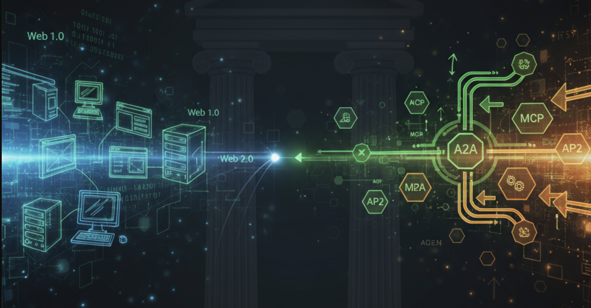
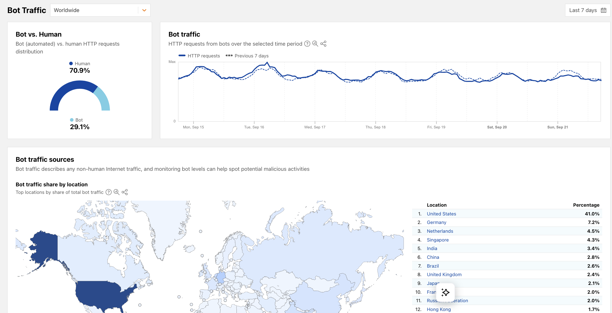

import AudioPlayer from '@site/src/components/audio';
import CogFlow from '@site/src/components/reactFlow';
import ProtocolComparison from '@site/src/components/protocolComparison';

Here at Sunholo, we've specialised in deploying GenAI applications for the past few years. Recently, when talking to new prospects we have noticed a trend: they show us their own internal chatbot, built at great expense just 18 months ago, and ask why it feels already outdated compared to ChatGPT or Gemini. Is there a better way to keep on the cutting edge but still keep your AI application bespoke? The answer takes us on a journey through web history, emerging protocols, and a future that's arriving faster than most realize.

<AudioPlayer src="https://storage.googleapis.com/sunholo-public-podcasts/The_Protocol_Wars__Why_Your_Custom_AI_Is_Failing_and_How_New_St.mp4" />

<!-- truncate -->

## AI Web = Web 1.0 / 2.0 ?

Remember Web 1.0? That nostalgic era of disparate hobby websites, the dot-com bubble, and the rise of search engines? One framing of that era could be that web-enabled companies were offering a new way to access their databases, transforming their data into HTML web portals.  This read-only access gave birth to the information superhighway, and we felt a boom (and bust) as that data was given in exchange for traffic and ad revenue.

Web 2.0 evolution occurred when companies started to let users WRITE as well as READ to those databases. Suddenly websites could update in real-time with user generated content: blog comments, tweets, social interactions. Facebook and others then built walled gardens around that data and monetised it with personalised feeds, selling user behaviour to companies for highly targeted advertising in exchange for enhanced communications with one another. 

The AI evolution could be said to be following the same pattern, only accelerated. ChatGPT started with conversations with static models, with chat history context.  Then everyone got excited by vector embeddings and RAG for passing in their own data into the model's context window and prompts. Now users and 3rd parties can bring their own data, as Agentic AI reaches out for other sources. But there's a problem.

## The Integration Nightmare

MIT's recent study claimed that 95% of generative AI pilots fail to achieve rapid revenue acceleration:

- [MIT report: 95% of generative AI pilots at companies are failing | Fortune](https://fortune.com/2025/08/18/mit-report-95-percent-generative-ai-pilots-at-companies-failing-cfo/) 

But that tells only part of the story. What they don't say is why.  

One reason could be that self-build AI applications need to have unique user interfaces or unique data to be any better than the generic AI applications.  If you don't have either of those (preferebly both) then you are going to be going head-to-head with hyperscalers with more resources than you.  To be of value, your internal AI tools needed custom integration with internal data sources and custom UIs, and home-spun solutions can quickly become outdated as the rapid pace of AI abilities outpaces developer project time. 

What's the answer? Standards. It is the experience from thousands of AI deployments across the world that has enabled AI commmuity feedback necessary for standard protocols to emerge.

## The Protocols Emerge (MCP & A2A)

In November 2024, Anthropic released the [Model Context Protocol (MCP)](https://www.anthropic.com/news/model-context-protocol). It addressed the emerging need for AI industry standards for what everyone was building, but in slightly different ways. MCP isn't particularly unique in its properties, much like HTTP wasn't. The value of a protocol comes only if and when it gains widespread adoption.

Anthropic was the perfect source for this initiative. They're respected by developers for their model's coding capabilities but also neutral enough, being deployed across Google Cloud, AWS, and Azure, to be trusted by everyone.

Then in April 2025, Google announced the Agent2Agent (A2A) protocol, backed by 50+ tech companies 

* [Announcing the Agent2Agent Protocol (A2A) - Google Developers Blog](https://developers.googleblog.com/en/a2a-a-new-era-of-agent-interoperability/). 

While MCP connects AI to tools and data, A2A defines how AI agents collaborate. It's the difference between giving workers tools and teaching them to work as a team.

The A2A protocol again would only be of value if it was not a vendor lock-in to Google, so it was deliberately kept vendor-neutral, transferred to the open source [Linux Foundation project](https://developers.googleblog.com/en/google-cloud-donates-a2a-to-linux-foundation/) and so is also endorsed by competitor AI companies such as AWS, Salesforce, ServiceNow, Microsoft and IBM. Like HTTP before it, A2A's value only emerges through universal adoption.

<ProtocolComparison
  title="From HTTP to A2A: How Protocols Shape Technology Eras"
  mode="timeline"
  showLegend={false}
  items={[
    {
      name: "HTTP/HTML",
      year: "1990s",
      features: ["Read-only databases", "Static content", "Ad revenue model"],
      description: "Web 1.0 - Companies offered read-only access to databases in exchange for traffic",
      color: "#666",
      stats: { adoption: "Universal" }
    },
    {
      name: "SSL/HTTPS",
      year: "1995",
      features: ["Encrypted transactions", "Digital certificates", "E-commerce enabler"],
      description: "The first protocol to enable trust in online commerce - without it, no Web 2.0",
      color: "#4a5568",
      hideInComparison: true
    },
    {
      name: "3D Secure",
      year: "2001",
      features: ["Human authentication", "Fraud prevention", "Payment verification"],
      description: "Like AP2 for humans - proving you authorized that credit card transaction",
      details: "3D Secure (Verified by Visa, Mastercard SecureCode) authenticates online card payments. It's the Web 2.0 equivalent of AP2 - both solve 'How do we verify this transaction is authorized?' for their respective actors.",
      color: "#dc2626",
      hideInComparison: true
    },
    {
      name: "Web 2.0 APIs",
      year: "2000s", 
      features: ["Write access to databases", "User-generated content", "Walled gardens"],
      description: "Companies let users WRITE to databases, creating social platforms and targeted ads",
      color: "#999",
      stats: { adoption: "Mainstream" }
    },
    {
      name: "OAuth 2.0",
      year: "2012",
      features: ["Delegated access", "API economy", "Third-party apps"],
      description: "Enabled the app ecosystem - let services talk without sharing passwords",
      color: "#7c3aed",
      hideInComparison: true
    },
    {
      name: "ChatGPT Launch",
      year: "Nov 2022",
      features: ["AI goes mainstream", "Chat interface", "No code required"],
      description: "The moment AI became accessible to everyone - sparking the custom chatbot gold rush",
      details: "ChatGPT reached 100 million users in just 2 months, making it the fastest-growing consumer application in history. This sparked thousands of companies to build custom chatbots - many of which feel outdated just 18 months later.",
      links: [
        { title: "MIT Study: 95% of AI Pilots Fail", url: "https://fortune.com/2025/08/18/mit-report-95-percent-generative-ai-pilots-at-companies-failing-cfo/" }
      ],
      color: "#10b981",
      hideInComparison: true
    },
    {
      name: "GPT-4",
      year: "Mar 2023",
      features: ["Rapid improvement", "Multimodal", "Extended context"],
      description: "The pace of change that makes 18-month-old chatbots feel obsolete",
      color: "#10b981",
      hideInComparison: true
    },
    {
      name: "Google Bard/Gemini",
      year: "Mar 2023",
      features: ["Competition intensifies", "Free access", "Integration race"],
      description: "Big Tech enters - now everyone needs to keep up with multiple AI providers",
      color: "#4285f4",
      hideInComparison: true
    },
    {
      name: "MCP",
      year: "Nov 2024",
      features: ["Standard tool access", "No custom integrations", "Universal context"],
      description: "The integration nightmare ends - AI can now connect to any tool without custom code",
      details: "MCP provides a universal, open standard for connecting AI systems with data sources. Like USB-C for AI, it replaces fragmented integrations with a single protocol. Pre-built servers exist for Google Drive, Slack, GitHub, and more.",
      links: [
        { title: "Official MCP Announcement", url: "https://www.anthropic.com/news/model-context-protocol" },
        { title: "MCP Documentation", url: "https://modelcontextprotocol.io" },
        { title: "GitHub Repository", url: "https://github.com/modelcontextprotocol" }
      ],
      color: "#0066cc",
      stats: { adoption: "Growing", companies: "100+" }
    },
    {
      name: "A2A",
      year: "Apr 2025",
      features: ["Agent teamwork", "Cross-platform", "Vendor neutral"],
      description: "AI agents can now collaborate - the difference between tools and teams",
      details: "A2A enables AI agents built on diverse frameworks to communicate and collaborate. It complements MCP - while MCP connects agents to tools, A2A enables agent-to-agent collaboration. Now backed by 150+ organisations including Microsoft, IBM, and SAP.",
      links: [
        { title: "A2A Announcement Blog", url: "https://developers.googleblog.com/en/a2a-a-new-era-of-agent-interoperability/" },
        { title: "A2A GitHub Repository", url: "https://github.com/a2aproject/A2A" },
        { title: "Getting Started with A2A", url: "https://codelabs.developers.google.com/intro-a2a-purchasing-concierge" },
        { title: "Google Agentspace", url: "https://cloud.google.com/products/agentspace" }
      ],
      color: "#00aa44",
      stats: { backers: "50+", status: "Active" }
    },
    {
      name: "AP2",
      year: "Sep 2025",
      features: ["Agent commerce", "Micropayments", "Trust verification"],
      description: "The agent economy arrives - AI can hire AI, pay per use, no humans required",
      details: "AP2 uses cryptographically-signed 'Mandates' to prove user authorisation for transactions. Supports credit cards, crypto, and bank transfers. Partners include American Express, Mastercard, PayPal, Coinbase, and 60+ others.",
      links: [
        { title: "AP2 Announcement", url: "https://cloud.google.com/blog/products/ai-machine-learning/announcing-agents-to-payments-ap2-protocol" },
        { title: "How AP2 Works", url: "https://cloud.google.com/blog/products/ai-machine-learning/announcing-agents-to-payments-ap2-protocol" }
      ],
      color: "#ff9900",
      stats: { partners: "60+", includes: "Mastercard, PayPal" }
    }
  ]}
/>

## The Next Step: AI Commerce

Google's recent Agent Payments Protocol (AP2) is an extension to A2A, developed with 60+ organisations including Mastercard and PayPal 

- [Announcing Agent Payments Protocol (AP2) | Google Cloud Blog](https://cloud.google.com/blog/products/ai-machine-learning/announcing-agents-to-payments-ap2-protocol), 

AP2 adds what might be the most transformative element. Entirely new business models can now emerge based on the value added by each individual agent, and those negotiations on buying and selling can also be done by the AP2 enabled agents with or without human intervention.

Picture this: Your market research agent needs real-time data. It automatically purchases $0.02 worth of web scraping from a data harvester agent, then pays $0.05 to a sentiment analysis specialist for processing, $0.01 to a fact-checker agent for verification, and finally $0.03 to a visualisation agent for charts. Hundreds of micro-transactions per minute, agents bidding for work, specialised models competing on price and quality. No humans involved, just AI agents trading skills and knowledge in a digital marketplace. The agent economy isn't coming; it's being built right now.

### How A2A and MCP Work Together

Here's a practical example of how these protocols interact in a real-world scenario: A company's research agent needs to analyze market data across multiple languages and data sources:

<CogFlow
  title="A2A and MCP Protocol Interaction"
  nodes={[
    { id: '1', data: { label: '👤 User Request', hasInput: false, hasOutput: true }, position: { x: 400, y: 20 }, type: 'customNode' },
    { id: '2', data: { label: '🏢 Research Agent [A2A]', hasInput: true, hasOutput: true, backgroundColor: '#d4f4dd', borderColor: '#00aa44' }, position: { x: 400, y: 120 }, type: 'customNode' },
    { id: '3', data: { label: '📊 Market Agent [A2A]', hasInput: true, hasOutput: true, backgroundColor: '#d4f4dd', borderColor: '#00aa44' }, position: { x: 200, y: 240 }, type: 'customNode' },
    { id: '4', data: { label: '🌐 Translation Agent [A2A]', hasInput: true, hasOutput: true, backgroundColor: '#d4f4dd', borderColor: '#00aa44' }, position: { x: 600, y: 240 }, type: 'customNode' },
    { id: '5', data: { label: '📈 Bloomberg [MCP]', hasInput: true, hasOutput: true, backgroundColor: '#e6e6e6', borderColor: '#666' }, position: { x: 55, y: 450 }, type: 'customNode' },
    { id: '6', data: { label: '🗄️ Database [MCP]', hasInput: true, hasOutput: true, backgroundColor: '#e6e6e6', borderColor: '#666' }, position: { x: 200, y: 380 }, type: 'customNode' },
    { id: '7', data: { label: '💎 Gemini [LLM]', hasInput: true, hasOutput: true, backgroundColor: '#f0e6ff', borderColor: '#9933cc' }, position: { x: 350, y: 320 }, type: 'customNode' },
    { id: '8', data: { label: '🧠 Claude [LLM]', hasInput: true, hasOutput: true, backgroundColor: '#f0e6ff', borderColor: '#9933cc' }, position: { x: 550, y: 380 }, type: 'customNode' },
    { id: '9', data: { label: '📁 Drive [MCP]', hasInput: true, hasOutput: true, backgroundColor: '#e6e6e6', borderColor: '#666' }, position: { x: 750, y: 380 }, type: 'customNode' },
    { id: '10', data: { label: '💳 Payments [AP2]', hasInput: true, hasOutput: true, backgroundColor: '#ffe6cc', borderColor: '#ff9900' }, position: { x: 400, y: 520 }, type: 'customNode' },
    { id: '11', data: { label: '📋 Report', hasInput: true, hasOutput: false }, position: { x: 400, y: 620 }, type: 'customNode' },
  ]}
  edges={[
    { id: 'e1-2', source: '1', target: '2', label: '', animated: true, style: { stroke: '#0066cc', strokeWidth: 2 } },
    { id: 'e2-3', source: '2', target: '3', label: 'A2A', animated: true, style: { stroke: '#00aa44', strokeWidth: 2 } },
    { id: 'e2-4', source: '2', target: '4', label: 'A2A', animated: true, style: { stroke: '#00aa44', strokeWidth: 2 } },
    { id: 'e3-5', source: '3', target: '5', label: 'MCP', animated: false, style: { stroke: '#666', strokeDasharray: '5,5' } },
    { id: 'e3-6', source: '3', target: '6', label: 'MCP', animated: false, style: { stroke: '#666', strokeDasharray: '5,5' } },
    { id: 'e3-7', source: '3', target: '7', label: '', animated: false, style: { stroke: '#9933cc', strokeDasharray: '3,3' } },
    { id: 'e4-8', source: '4', target: '8', label: '', animated: false, style: { stroke: '#9933cc', strokeDasharray: '3,3' } },
    { id: 'e4-9', source: '4', target: '9', label: 'MCP', animated: false, style: { stroke: '#666', strokeDasharray: '5,5' } },
    { id: 'e3-10', source: '3', target: '10', label: '$0.05', animated: false, style: { stroke: '#ff9900' } },
    { id: 'e4-10', source: '4', target: '10', label: '$0.10', animated: false, style: { stroke: '#ff9900' } },
    { id: 'e10-11', source: '10', target: '11', label: '', animated: true, style: { stroke: '#0066cc', strokeWidth: 2 } },
  ]}
  height="700px"
/>

In this example:
- **A2A Protocol** handles agent-to-agent communication: The company's research agent discovers and coordinates with external specialist agents
- **MCP Protocol** connects agents to tools and data: Each agent uses MCP to access databases, APIs, and file systems
- **AP2 Protocol** manages micropayments: External agents charge small fees automatically without human intervention
- **LLMs** provide the intelligence: Agents use various models (Claude, GPT, Gemini) for their specific tasks

The beauty is that the company's research agent doesn't need to know how the translation agent works internally, or which LLM it uses. It just sends an A2A task request and receives results. Similarly, agents don't need custom integrations for each tool—MCP provides a standard interface to everything from databases to SaaS APIs.

## The Living Laboratory

[Google Agentspace](https://cloud.google.com/products/agentspace), already deployed at companies like Wells Fargo, KPMG, and Nokia, shows what this A2A led infrastructure looks like in practice. It's one of Google Cloud's fastest-growing products ever.  See a demo video below - the Agent Gallery is all enabled by A2A:

<iframe width="560" height="315" src="https://www.youtube.com/embed/V-r0WjXJhL8?si=NZVJhZewYq5RXCNK" title="YouTube video player" frameborder="0" allow="accelerometer; autoplay; clipboard-write; encrypted-media; gyroscope; picture-in-picture; web-share" referrerpolicy="strict-origin-when-cross-origin" allowfullscreen></iframe>

That dusty SharePoint archive from 2015? Suddenly searchable alongside this morning's Slack conversations. The rigid SAP system that took six months to integrate? Now accessible to AI agents without touching a line of code. Agentspace leverages A2A and has announced an A2A marketplace for seamless integration with its platform from all: including non-Google vendors, would-be rivals and open-source competitors. 

As proof of that commitment to avoid vendor lock-in, the A2A protocol works with all major AI frameworks such as Langchain and Pydantic AI but also including Google's own ADK, demonstrating the power of unified AI access to enterprise data.

## Embrace inflexible standards to be flexible in delivery

After the first two years post Chat-GPT in the AI trenches, we are seeing a pattern for the AI early adopters. A lot of companies that were cutting edge in 2023 — the ones who built chatbots plus RAG for internal document search — are now stuck. They can't keep up with the pace of AI improvements by the hyperscalers. Every time Gemini, Claude or OpenAI releases an update such as artifacts, thinking tokens or code execution, they face months of integration work to match it with less resources.

This is the [bitter lesson of AI](http://www.incompleteideas.net/IncIdeas/BitterLesson.html) applied to AI infrastructure. As Rich Sutton writes: 

> "The biggest lesson that can be read from 70 years of AI research is that general methods that leverage computation are ultimately the most effective, and by a large margin." Over a long enough timespan, specialised solutions lose to general approaches that leverage computation. 

But we're learning a corollary: rigid infrastructure becomes tomorrow's technical debt, fast.  For example, the "chat-to-PDF" features of 2023 usually involved data pipelines that are now redundant in modern AI deployments since that feature is now just one AI API call away. The PDF parsing pipelines that were developed and worked in 2023 are now actually hindering performance of PDF understanding if unable to use the new vision or file multi-modal abilities of modern AIs.

The solution isn't just technical, but philosophical. Build for change, not features. Every AI component needs to be independently replaceable, like swapping batteries rather than rewiring your house. When OpenAI, Google or Claude releases a new model or feature next month (and they will), you should be able to adapt to it within hours, especially in this AI-code assisted future. If you get it right, then your application automatically improves in lock step with the AI models underneath it.  The restrictions of complying with protocols give you the freedom to be flexible.

Get it wrong however, and you are stuck with old features that your staff do not use in favour of "shadow AI" being used via personal phones or bypassing VPN controls.  Why that matters?  Those interactions are incredibly valuable in assessing what your colleagues are actually working on, including what drives are important for your company. Passing that to a 3rd party and not having those AI conversations available for your own review gives the keys to your business improvement elsewhere, out of your control.

## The Non-Human Web Emerges

Humans are becoming less likely to be direct consumers of web data. We may soon reach peak human web traffic, with the proportion of human traffic ever declining from now on in favour of AI bot traffic.

*Chart from https://www.economist.com/business/2025/07/14/ai-is-killing-the-web-can-anything-save-it*

Google's AI Overviews now appear in over 35% of U.S. searches, with some sites reporting traffic drops of up to 70%. According to Pew Research, just 8% of users who encountered an AI summary clicked through to a traditional link—half the rate of those who didn't 

* [Pew Research Confirms Google AI Overviews Is Eroding Web Ecosystem | Search Engine Journal](https://www.searchenginejournal.com/pew-research-confirms-google-ai-overviews-is-eroding-web-ecosystem/551825/).

Think about your own behavior. How often do you ask ChatGPT or Google's AI for information instead of visiting websites yourself? Now multiply that by billions of users and add AI agents that never sleep, never get tired, and can visit thousands of sites per second.

Currently, there's a booming market for web scrapers—tools that help AI read websites designed for humans. But we propose that this is transitional, like mobile websites before responsive design. The same databases that generate HTML for humans are able to generate tailored AI responses via MCP and A2A directly to AI agents, without the messy parsing of HTML.

Another current alternative is [/llm.txt](https://llmstxt.org/) which AI-savvy websites are using, that simply do the parsing for the AI without the need of going via a HTML parsing tool.  It strips away all the messy HTML and offers text only content for hungry AI to process.  We're building a parallel web for machines.

## The Business Model Breaking Point

The impact on media and content businesses is existential. Cloudflare (who can see ~20% of total web traffic, 63 million requests per second) data shows that for every visitor Anthropic refers back to a website, its crawlers have already visited tens of thousands of pages. OpenAI's crawler scraped websites 1,700 times for every referral, while Google's ratio was 14-to-1 

* [The crawl-to-click gap: Cloudflare data on AI bots, training, and referrals | Cloudflare](https://blog.cloudflare.com/crawlers-click-ai-bots-training/).

*Cloudflare tracks human vs bot traffic in its radar dashboard https://radar.cloudflare.com/bots*

This unsustainable imbalance led to a radical response. In July 2025, Cloudflare announced it could block AI crawlers by default and launched ["Pay Per Crawl"](https://blog.cloudflare.com/introducing-pay-per-crawl/) — a solution where publishers can charge AI companies for each page crawled. It's the first serious attempt to create a new business model for the AI era, where content isn't just consumed but compensated.  Here the current HTTP protocol is invoked, using an obscure HTTP access code 402 (as opposed to 404, 200 etc) indicating "Payment Required".

## The Human Question

What happens to humans in this new world? Beautiful showroom websites will likely remain as spaces for inspiration and brand experience. But the messy functionality of websites: complex forms, comparison shopping, detailed research, could likely shift to AI agents working in the background.

Some companies are betting on the "everything app" approach. OpenAI and X.com seem to envision users never leaving their platforms, consuming all content through a single AI interface. It's Web 2.0's walled gardens taken to their logical extreme.

How does this impact web analytics? E-commerce conversion rates? Media websites that survived on impression-based advertising now face an extinction-level event.

## The Privacy Revolution Returns

There's a twist in our story that harks back to Web 2.0's original promise: users controlling their own data.

What if individuals maintained their own A2A or MCP servers? All your purchase history, preferences, relationships, and interests in one place, under your control. You'd grant selective access to services in exchange for better experiences—verified, accurate profiles instead of the creepy tracking and guessing that defines today's web.

The protocols make this technically feasible today. The question is whether a post-GDPR population, increasingly aware of privacy violations, will demand it. Could user-controlled AI servers become the next revolution?

And this time around, the privacy stakes are higher.  People were worried about Cambridge Analytica interpreting signals from user behaviour via web traffic analytics potentially inlfuencing elections via paid ads.  Thats insignficiant next the potential harm that could be done by an AI that is super persuasive, with access to all your thoughts, dreams and desires typed into its chat box.

## The Inflection Point

We're witnessing the end of AI's wild west phase. Standards are emerging. The organisations recognising this shift—building for tomorrow's pace of change rather than today's requirements—will define the next era.

The future isn't about having the best AI. It's about having AI that can collaborate with everyone else's AI, upgrade without breaking, experiment without committing, and respect user privacy and control.

The protocols are here. The early adopters are moving. The business models are being rewritten—from impression-based advertising to pay-per-crawl, from human web traffic to agent economies. The question isn't whether to embrace these standards, but whether you'll be part of the 5% that succeed or the 95% still trying to maintain custom integrations that were obsolete before they were finished.

History doesn't repeat, but it rhymes. The web's evolution from chaos to standards to walled gardens to user control could be playing out again, just faster and with artificial minds as the primary actors.  Will user privacy follow the same path, or do we have a chance to reshape the balance between user and company, to preserve human dignity? The stakes look to be higher this time around.

Where does your organisation fit in this story?

---

*Want to discuss how to navigate this transition? Reach out at multivac@sunholo.com or visit [www.sunholo.com](https://www.sunholo.com)*