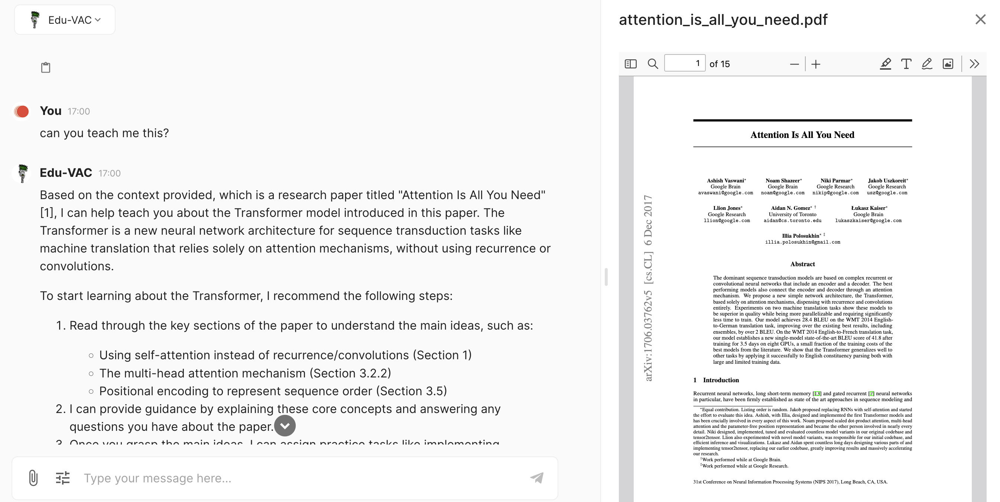

# EduVAC


This VAC is a Langserve app that allows users to interact via a database to learn specific material.  It imports the data or allows users to upload their own files and get the bot to teach them using adaptive learning techniques, tailoring the lesson plan according to the student responses and previous experience.

Its code is open-source here: https://github.com/sunholo-data/vacs-public/tree/dev/eduvac



## Summary

This VAC application incorporates the following features:

* A Pydantic typed Question input schema:

```python
class ChatEntry(BaseModel):
    name: str
    content: str

class Question(BaseModel):
    question: str
    chat_history:   Optional[List[ChatEntry]] = []
    source_filters: Optional[List[str]] = []
    private_docs:   Optional[List[str]] = []
    source_filters_and_or: Optional[bool] = False
```

The `sunholo` functions within [`sunholo/agents/langserve.py`](sunholo/agents/langserve) query this input schema before sending it the payload to make sure it is in the correct format.

* A configurable model choice so paid users can use a more expensive but smarter model

Using Langserve configurables within sunholo streaming functions such as [`generate_proxy_stream_async()`](sunholo/streaming/streaming) you can configure Langserve attributes on the fly.

```python
config_model = quick_model.configurable_alternatives(
    ConfigurableField(
        id="role",
        name="User Role",
        description=(
            "The user role used to configure which model to use"
        ),
    ),
    eduvac=model,
    ADMIN=model,
    USER=quick_model,
)
```

This is called from the Sunholo clients by adding a `configurable` parameter:

```python
generate = await generate_proxy_stream_async
    **kwargs,
    # langchain configurable dictionary
    configurable={
        # if user role matches vector_name
        "role": app_user.metadata["role"],
        "vector_name": config["name"],
    })
```

* prompt including chat history, summary and pulled in document context

The main GenAI prompt uses these components to keep the conversation history relevant, and inserts the material that has been selected to learn within the client settings.

```python
_inputs = RunnableParallel({
        "metadata": RunnableLambda(get_retriever) | RunnableLambda(format_docs),
        "question": itemgetter("question"),
        "chat_history": RunnableLambda(format_chat_history) | itemgetter("chat_history"),
        "chat_summary": RunnableLambda(format_chat_summary) | summary_branch | itemgetter("chat_summary"),
    })
```

* Retrieve from docstore

The initial implementation uses AlloyDB as its storage backend.  It uses `get_sources_from_docstore_async()`[sunholo/database/alloydb] to fetch sources based on the `source_filters` and `source_filters_and_or` arguments.  You could replace this with any docstore.

* Prompt management

The prompts themselves are managed by Langfuse, or a back up yaml file using the [`kind: promptConfig`](../config.md) configuration.

* GenAI analytics

The GenAI calls are sent to the [Multivac Langfuse instance](https://langfuse.sunholo.com) using the callback function provided via [add_langfuse_tracing()](sunholo/langfuse/callback)


## Config yaml

An explanation of the configuration is below:

* `vac.pirate_speak` - this is the key that all other configurations are derived from, referred to as "vector_name"
* `llm`: The configuration specifies an LLM model.  You can swap this for any model supported by `sunholo` so that it can work with the `pick_llm()` function via `model = pick_llm("pirate_speak")`.
* `agent`: Required to specify what type of agent this VAC is, which determines which Cloud Run or other runtime is queried via the endpoints
* `display_name`: Used by end clients such as the webapp for the UI.
* `avatar_url`: Used by end clients such as the webapp for the UI.
* `description`: Used by end clients such as the webapp for the UI.
* `tags`: Used to specify which users are authorized to see this VAC, defined via `users_config.yaml`

```yaml
kind: vacConfig
apiVersion: v1
vac:
    pirate_speak:
        llm: openai
        agent: langserve
        #agent_url: you can specify manually your URL endpoint here, or on Multivac it will be populated automatically
        display_name: Pirate Speak
        tags: ["free"] # for user access, matches users_config.yaml
        avatar_url: https://avatars.githubusercontent.com/u/126733545?s=48&v=4
        description: A Langserve demo using a demo [Langchain Template](https://templates.langchain.com/) that will repeat back what you say but in a pirate accent.  Ooh argh me hearties!  Langchain templates cover many different GenAI use cases and all can be streamed to Multivac clients.
```
