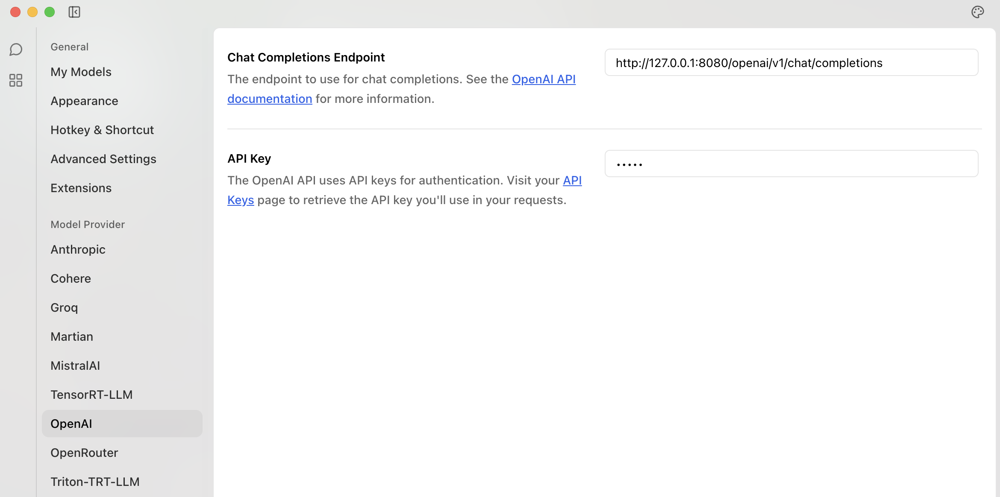
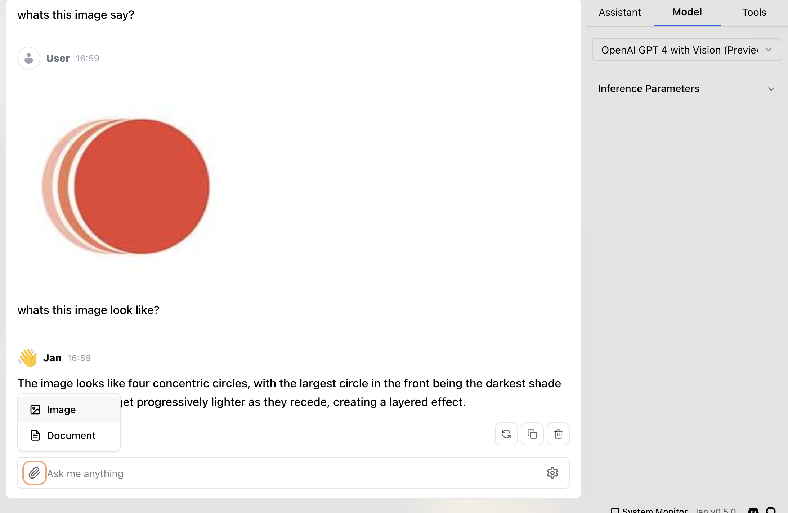

# Jan.ai

[Jan.ai](https://jan.ai/) is a desktop application that is similar to the OpenAI desktop application but you can use it with any local or online model.

## /openai/v1/chat/completions/<vector_name>

If you leave the `<vector_name>` blank, then the proxy will attempt to look in the config for the "model" name

e.g. if calling `/openai/v1/chat/completions/` then in the config you will need a VAC called "gpt-4o"

```yaml
...
  gpt-4o:
    llm: openai
    model: gpt-4o
    agent: langserve
...
```

### Custom VAC configuration

Otherwise you can use `/openai/v1/chat/completions/<vector_name>` to tailor the request to the VAC.

When proxying or using online, you can use this as the OpenAI endpoint configuration:



Below is an example of calling Gemini using VAC [`personal_llama`](../VACs/vertex-llamaindex) with Google Search.


### Image models

If you specify a vision multimodal model, then the OpenAI request will be parsed to upload to Google Cloud Storage:

