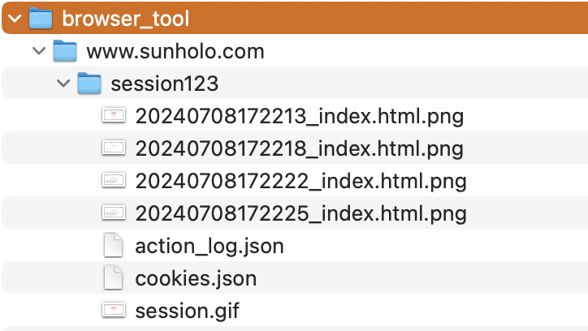

# Playwright

[Playwright](https://playwright.dev) is a web browsing developer tool that allows you to browse the web.

Vision (or Video) capable GenAI models can create playwright commands based on screenshots that are fed into them.  

## BrowseWebWithImagePromptsBot

The sunholo `BrowseWebWithImagePromptsBot()` class provides methods that you can hook into any GenAI vision model to enable prompt-to-browser features.  It coordinates working with your model and prompt to feed in screenshots until the stated "session goal" is achieved.

An example of it browsing the website looking for a VAC defintion is shown for demo purposes:


The `.gif` is created from the screenshots the model uses in its session.  The images are annotated where the bot clicked or typed text (the red circles in the gif)

Cookies and the action log of what happened are saved to disk:



Action log saves the model's description on what it did:

```json
["Navigated to https://www.sunholo.com", 
"The task is not complete as the FAQs are not shown. Clicked on the 'FAQ' button.", 
"Clicked on element with selector FAQ at x=459.5390625,y=48.0", 
"The task is not complete as I do not yet see the content of the FAQ. Clicked on the 'What is a VAC?' FAQ. ", 
"Clicked on element with selector What is a VAC? at x=145.67578125,y=359.79296875"]
```

### Using with your model

The class requires you to write a `send_prompt_to_llm()` method which will recieve the screenshots and prompt variables and output the instructions for the next browsing task.  A demo of doing this with [Gemini Flash 1.5](https://deepmind.google/technologies/gemini/flash/) is shown below:

```python
import os
import traceback
import json
import base64
import textwrap

from PIL import Image
from io import BytesIO
import google.generativeai as genai

from flask import Flask, request, jsonify

from sunholo.logging import setup_logging
from sunholo.tools import BrowseWebWithImagePromptsBot
from sunholo.vertex import (
    init_genai,
    genai_safety,
)

# Define schemas
instruction_schema = genai.protos.Schema(
    type=genai.protos.Type.OBJECT,
    properties={
        'action': genai.protos.Schema(type=genai.protos.Type.STRING),
        'selector': genai.protos.Schema(type=genai.protos.Type.STRING),
        'url': genai.protos.Schema(type=genai.protos.Type.STRING),
        'text': genai.protos.Schema(type=genai.protos.Type.STRING),
        'direction': genai.protos.Schema(type=genai.protos.Type.STRING),
        'amount': genai.protos.Schema(type=genai.protos.Type.INTEGER),
        'message': genai.protos.Schema(type=genai.protos.Type.STRING),
    },
    required=['action']
)

instructions_schema = genai.protos.Schema(
    type=genai.protos.Type.ARRAY,
    items=instruction_schema
)

next_browser_instructions = genai.protos.Schema(
    type=genai.protos.Type.OBJECT,
    properties={
        'status': genai.protos.Schema(type=genai.protos.Type.STRING),
        'new_instructions': instructions_schema,
        'message': genai.protos.Schema(type=genai.protos.Type.STRING)
    },
    required=['status']
)

class GeminiBot(BrowseWebWithImagePromptsBot):
    def send_prompt_to_llm(self, prompt_vars, screenshot_base64):
        init_genai()

        model = genai.GenerativeModel(
            model_name="models/gemini-1.5-flash",
            safety_settings=genai_safety(),
            # https://ai.google.dev/gemini-api/docs/json-mode?lang=python
            generation_config={"response_mime_type": "application/json",
                                "response_schema": next_browser_instructions,
                                "temperature": 0.5}
            )
        
        # Decode the base64 string to create an Image object
        screenshot = Image.open(BytesIO(base64.b64decode(screenshot_base64)))

        prompt = textwrap.dedent(f"""
            You are an AI assistant helping a user browse the web.
            The user has provided you with a screenshot of the current webpage and some details to help you achieve their goal.

            # User Session Goal: 
            Important! 
            {prompt_vars['session_goal']}

            ## Last Action Message
            The last AI assistant iteration has this message to you:
            {prompt_vars['last_message']}
            
            ## Playwright Actions
            This is a history of what Playwright instructions you have actioned so far:
            {prompt_vars['last_actions']}

            If you see repeating actions with an error, then you are in a loop - do something else.
            
            ## Instructions

            Based on the provided screenshot and the details, generate the next set of Playwright instructions for the bot to execute. 
            The instructions should be in JSON format and include the necessary details such as action type, selector, URL, text, direction, and amount.

            Allowed actions:
            - navigate: Navigate to a specified URL.
            - click: Click on an element specified by the text you see in the screenshot.
            - scroll: Scroll the page using the mouse whell in the specified direction ('down', 'up', 'left', 'right') by the specified amount in pixels.
            - type: Type the specified text into the element specified by the text you see in the screenshot

            Good example instruction format:
            [
                {{
                    "action": "navigate",
                    "url": "https://example.com",
                    "message": "Navigate to the example.com URL"
                }},
                {{
                    "action": "type",
                    "selector": "Search",
                    "text": "AI news",
                    "message": "Search for 'AI news' within the search field"
                }},
                {{
                    "action": "click",
                    "selector": "Submit"
                    "message" : "Click on submit button"
                }}
                {{
                    "action": "scroll",
                    "amount": "200"
                    "message" : "Scroll down the page 200 pixels"
                }}
            ]

            Bad example instruction format:
            - Instructions that are not in JSON format.
            - Using actions other than 'navigate', 'click', 'scroll', or 'type'.
            - Missing required fields such as 'action', 'selector', 'url', 'text', 'direction', or 'amount' when necessary.
            - Instructions that are ambiguous or unclear.
            - No 'message' field
            - Using CSS selectors and not text fields
            [
                {{
                    "task": "goto",
                    "address": "https://example.com"
                }},
                {{
                    "do": "write",
                    "locator": "input[name='search']",
                    "content": "AI news"
                }},
                {{
                    "perform": "press",
                    "target": "button[type='submit']"
                }}
                {{
                    "action": "click",
                    "selector": "a[href='/faq']"
                    "message" : "Click on submit button"
                }}
            ]

            ## Output format

            The 'message' key is used to populate the 'Last Action Message' for the next iteration of this request - make it useful for the next assistant so they can complete the session goal.
            Include in the 'message' key why you think the task is completed, an error or still in progress.
            Only put in the 'message' field information from the screenshot.  Do not put any information that is not seen in the screenshot.
            Put the instruction JSON and a status of the task in this format:
            
            {{
                'message': 'The task is not complete as I do not yet see any AI news content. Navigated to the example page and searched for AI news within the search bar',
                'status': 'in-progress',
                'new_instructions': {{
                    [
                        {{
                            "action": "navigate",
                            "url": "https://example.com",
                            "message": "Go to the example page"
                        }},
                        {{
                            "action": "type",
                            "selector": "input[name='search']",
                            "text": "AI news",
                            "message": "Searching for 'AI news' within the search field"
                        }},
                        {{
                            "action": "click",
                            "selector": "button[type='submit']"
                            "message" : "Click on submit button"
                        }}
                    ]
                }}
            }}

            ## Important: status

            - status: completed - Only set if you are clear the session goal has been achieved.
            - status: error: If any problems like infinite loops or if it looks like the history is corrupted use this status
            - status: in-progress - if not completed or an error, this is the status to enable the next step that will help the user. If the session goal has not been achieved, set the 'in-progress' status

            If status: in-progress is set then you MUST include new_instructions for the next step to complete.

            When doing the last iteration (status: completed) add to the 'messages' key any final summary of the session and anything useful for the session goal, but do not use any information outside of the web session screenshots or message history.
            An example of a good final message would be if the user wanted to find out news on AI, that you add the text of the page from the screenshot that triggered the completed session goal.
            Also include in the message a restatement of the session goal, and why you think the session goal has been completed.

            
        """)

        log.info(f"Browser prompt_vars: {prompt_vars}")

        # Generate content with the model
        response = model.generate_content([screenshot, prompt], tool_config={'function_calling_config':'ANY'})

        log.debug(f"Browser tool returns: {response=}")

        try:
            json_object = json.loads(response.text)
            log.info(f"Got valid json: {json_object}")

            return json_object
        
        except Exception as err:
            log.error(f"Failed to parse GenAI output to JSON: {response=} - {str(err)}")        
```

You can then put the model behind a HTTP endpoint to created a VAC and have it hooked into Multivac's Cloud Endpoints and Vertex Extension integrations.

```python
app = Flask(__name__)

@app.route('/browser', methods=['POST'])
def browser():
    data = request.form
    session_id = data.get('session_id')
    website_name = data.get('website_name')
    browser_type = data.get('browser_type', 'chromium')
    session_goal = data.get('session_goal', "")
    initial_instructions = data.get('instructions')

    bot = GeminiBot(
        session_id=session_id,
        website_name=website_name,
        browser_type=browser_type,
        headless=True
    )

    finished_session = bot.start_session(instructions=initial_instructions, session_goal=session_goal)

    return jsonify(finished_session)


if __name__ == "__main__":
    app.run(host="0.0.0.0", port=int(os.environ.get("PORT", 8080)), debug=True)
```

When testing locally, launch the app via `python app.py` then call it locally via:

```bash
 curl -X POST http://localhost:8080/browser \
    -F "session_id=session123" \
    -F "website_name=https://www.sunholo.com" \
    -F "browser_type=chromium" \
    -F "session_goal=Find out what the VAC acyonym means in Multi-VAC"
```
